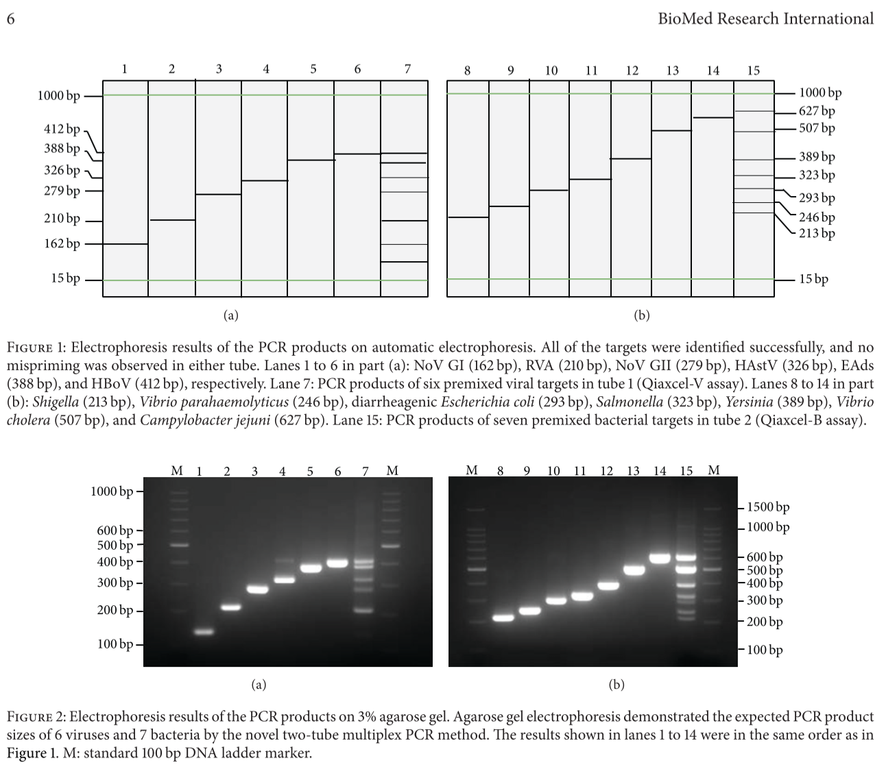

# What is PCR ?

당신은 살면서 이런 이미지들을 본 적 있는가?

{width="400"}

{width="400"}

{width="400"}

위의 사진을 본적 있다면, 다음 논문의 Figure가 무슨 말을 하고싶은지 아는가?

{width="400"}

[@wang2014]

------------------------------------------------------------------------

무슨 소리인지 하나도 모르겠다면!😱 앞으로 배워보는 시간을 가질 것이다.

-   PCR이 무엇인가

-   PCR은 왜 하는가

-   PCR은 어떻게 하는가

-   직접 해보자

-   PCR 활용

하지만, 그에 앞서, 우리의 말랑말랑한 뇌를 일깨우는 시간을 가져보자🙂

-   DNA & RNA

-   Where is Nucleic Acid

-   Central Dogma

-   Prokaryote & Eukaryote

------------------------------------------------------------------------
